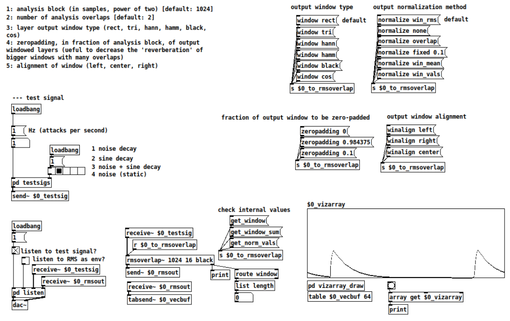

## rmsoverlap~

A simple Pure Data object to extract RMS from an input signal using overlapping windows and different window types.  The window types influence how the mean value of each overlapping layer is interpolated.



### Note

This project is part of a larger ongoing effort to develop and explain concepts related to Pure Data DSP machine listening externals coding. It serves as both a practical tool and an educational resource.

---

### Overview

`rmsoverlap~` calculates the Root Mean Square (RMS) of an incoming audio signal.  It does this by dividing the signal into overlapping segments (windows), applying a window function (e.g., Hanning, rectangular), and then calculating the RMS of each window.  The overlapping nature means that each sample contributes to multiple RMS calculations, and the final output is a smoothed RMS value over time.  The object also offers various normalization options.

### Features

*   **Overlapping Windows:**  The core functionality.  The signal is processed in overlapping windows, providing a more continuous and less abrupt RMS estimation than non-overlapping methods.
*   **Window Types:**  Supports several common window functions:
    *   `rect` (Rectangular):  A simple on/off window (all samples have equal weight).
    *   `hann` (Hanning): A raised cosine window, commonly used to reduce spectral leakage.
    *   `tri` (Triangular):  A linear ramp up and down.
    *   `hamm` (Hamming): Similar to Hanning, but with slightly different coefficients.
    *   `black` (Blackman):  Another window designed for good spectral leakage reduction.
    *   `cos` (Cosine): A simple sine wave window.
*   **Window Alignment:** Controls how zero-padding is applied to the window:
    *   `left`:  Zeros are added to the right of the window.
    *   `center`: Zeros are added equally to the left and right.
    *   `right`: Zeros are added to the left of the window.
*    **Zero-padding**: it is possible to define a percentage of samples of the analysis window as zero, in order to avoid border problems in the calculations
*   **Normalization Methods:**  Different ways to normalize the RMS output:
    *   `win_rms` (default):  Normalizes by the RMS of the overlapping window segments (this corrects for the amplitude reduction caused by windowing).
    *   `win_mean`:  Normalizes by the mean of the absolute values of the overlapping window segments.
    *   `win_vals`: Normalizes by the sum of overlapping window segments at each sample (sample-by-sample normalization).
    *   `overlap`:  Normalizes by dividing by the number of overlaps.
    *   `fixed`:  Multiplies the output by a fixed value (specified as a float argument).
    *   `none`:  No normalization is applied.
*    **Get methods**: it is possible to access (as lists) the window values, the sum of the window overlapping values for normalization and, finally, the output normalization factors for each sample.
*   **Dynamic Control:**  Window type, alignment, zero-padding, and normalization can be changed on the fly using messages.

### Creation

```puredata
[rmsoverlap~ <window size> <overlaps> <window type> <zero-padding> <window alignment>]